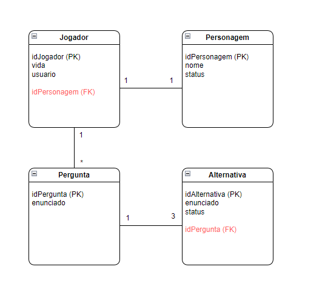
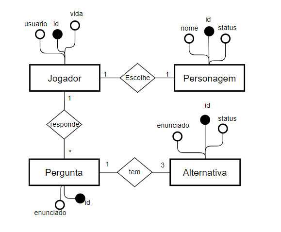

# ProjetoPSC

Um jogo de perguntas e repostas sobre programação e modelagem de software, onde o objetivo é ensinar e aprender de forma divertida.

--- 
 

## Colaboradores

- <a href="https://github.com/anaclaraddias"> anaclaraddias </a>
- <a href="https://github.com/Camoreiira"> Camoreiira </a>
- <a href="https://github.com/marquesgabriela"> marquesgabriela </a>
- <a href="https://github.com/joaoeduardo08"> joaoeduardo08 </a>

 

## Diagrama de classes 

 

## Modelo Entidade Relacionamento da base de dados
